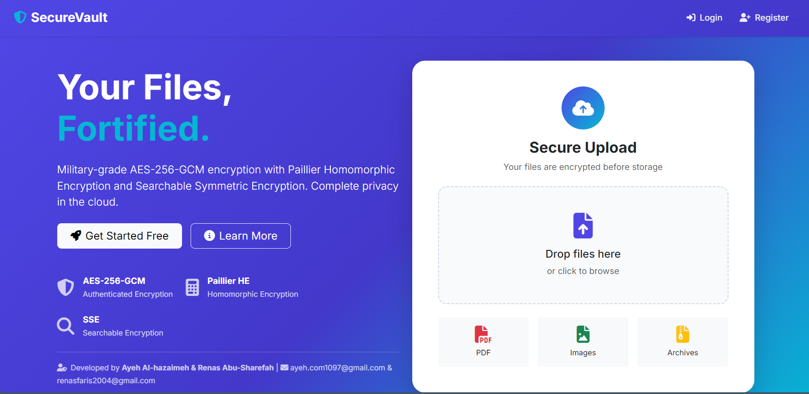
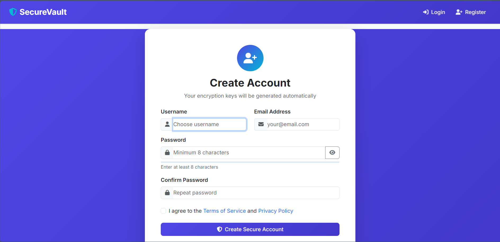
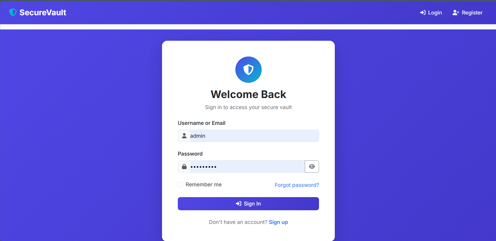
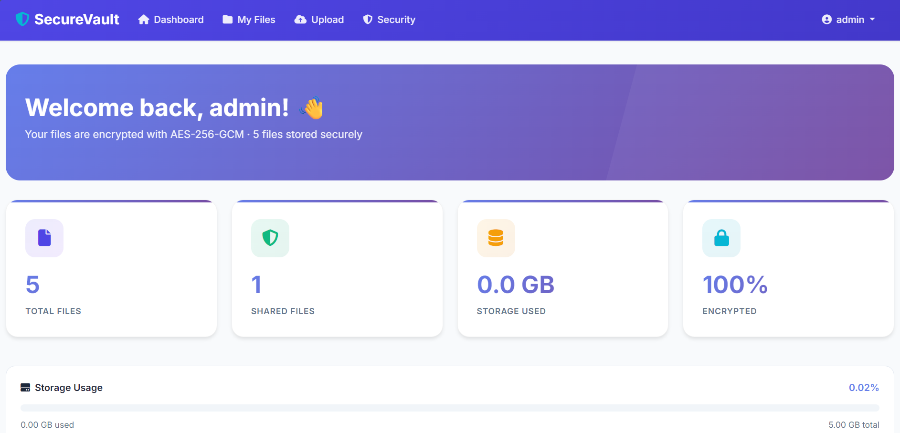
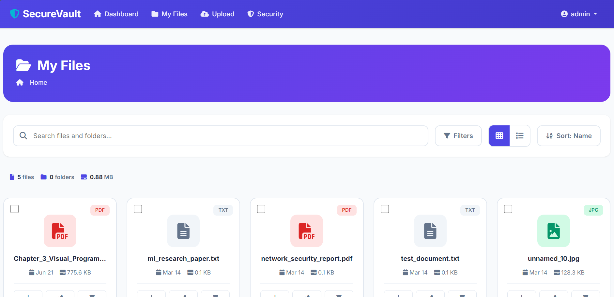
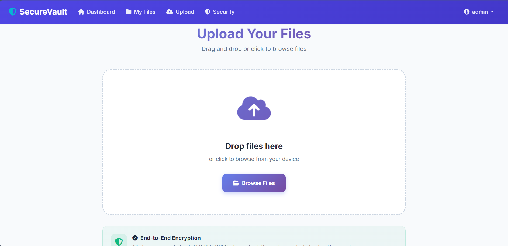
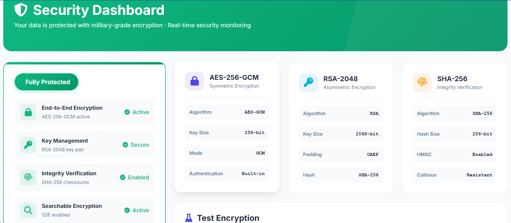
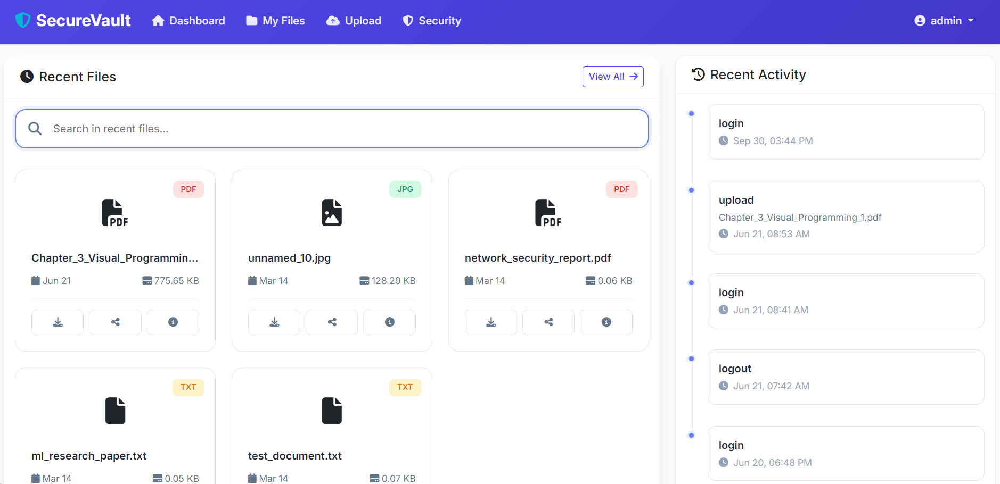
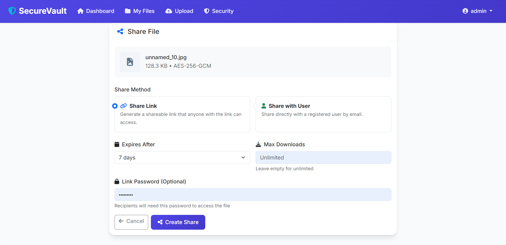
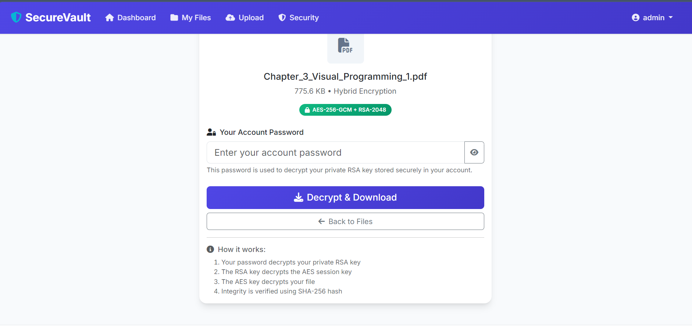

# 🔐 SecureVault — Secure Cloud Storage System

A Flask-based secure cloud storage application designed to protect user files through encryption, secure key management, integrity verification, secure file sharing, searchable encryption, and privacy-preserving file statistics.

## 📌 Project Overview

**SecureVault** is a graduation project developed to explore practical approaches to protecting files in a cloud-based storage environment.

The system combines **symmetric and asymmetric cryptography** to protect file content and encryption keys, while also providing mechanisms for **file integrity verification, secure file sharing, searchable encryption, and privacy-preserving file statistics**.

## 🛠️ Technologies

* **Python**
* **Flask**
* **SQLAlchemy**
* **MySQL / SQLite**
* **HTML, CSS, JavaScript**
* **Bootstrap**
* **Flask-Login**
* **Flask-WTF / CSRF Protection**
* **Cryptography Library**

## 🔒 Security Features

### AES-256-GCM File Encryption

Files are encrypted using **AES-256-GCM**, providing confidentiality and authenticated encryption.

A unique random AES key is generated for each file.

### RSA-2048 Key Protection

The generated AES file key is protected using **RSA-2048** with **OAEP and SHA-256**.

This hybrid encryption approach combines the efficiency of symmetric encryption with asymmetric key protection.

### Password-Based Key Derivation

The application uses **PBKDF2-HMAC-SHA256** with **600,000 iterations** for password-based key derivation and protected private-key handling.

### File Integrity Verification

**SHA-256** hashes are used to verify file integrity and detect unexpected modifications.

### Searchable Encryption

The system includes **Searchable Symmetric Encryption (SSE)** functionality using HMAC-based tokens for protected search operations.

### Privacy-Preserving File Statistics

The application includes a **Paillier homomorphic encryption** component for privacy-preserving file-size statistics and selected calculations on encrypted values.

### Authentication & Authorization

The system provides:

* User registration and login
* Password hashing
* Session management
* Access control
* Secure file sharing
* CSRF protection

## 🔄 File Protection Workflow

### Upload

1. The user uploads a file.
2. A **SHA-256** hash is generated for integrity verification.
3. A random **AES-256** file key is generated.
4. The file is encrypted using **AES-256-GCM**.
5. The AES file key is protected using the user's **RSA-2048 public key**.
6. The encrypted file and protected key information are stored by the application.
7. Additional features such as searchable encryption and privacy-preserving statistics can be applied where supported.

### Download

1. The application retrieves the protected file information.
2. The user's protected RSA private key is unlocked using a password-derived key.
3. **RSA** is used to recover the AES file key.
4. **AES-256-GCM** decrypts the file.
5. The GCM authentication tag is verified.
6. The **SHA-256** integrity value is checked.
7. The original file is restored when verification succeeds.

## 🔎 Searchable Encryption

SecureVault provides an **SSE-based search mechanism** using protected search tokens rather than directly exposing searchable terms.

The project also includes content indexing for supported text-based file types.

## 📊 Privacy-Preserving Statistics

The application includes a **Paillier-based component** for performing selected calculations on encrypted file-size statistics.

This demonstrates how **homomorphic encryption** can support computation on protected values without directly exposing the underlying data.

## 📸 Project Screenshots

### Home



### Register



### Login



### Dashboard



### My Files



### Upload & Encryption



### Security Dashboard



### Search



### File Sharing



### Decrypt & Download



## 📂 Main Application Structure

```text
SecureVault/
│
├── app/
│   ├── __init__.py
│   ├── crypto.py
│   ├── models.py
│   ├── routes.py
│   ├── search_helpers.py
│   ├── search_routes.py
│   └── security_routes.py
│
├── templates/
│   └── Flask HTML templates
│
├── Screenshots/
│   ├── 01-home.png
│   ├── 02-register.png
│   ├── 03-login.png
│   ├── 04-dashboard.png
│   ├── 05-my-files.png
│   ├── 06-upload-encryption.png
│   ├── 07-security-dashboard.png
│   ├── 08-search.png
│   ├── 09-file-sharing.png
│   └── 10-decrypt-download.png
│
├── config.py
├── run.py
├── requirements.txt
├── .env.example
├── .gitignore
├── setup.bat
├── setup.sh
├── start.bat
└── start.sh
```

## 🚀 Getting Started

### Requirements

* Python 3.8+
* MySQL for production configuration, or SQLite for development/testing
* Git

### Windows

Run:

```bash
setup.bat
```

Then:

```bash
start.bat
```

### Linux / macOS

```bash
chmod +x setup.sh start.sh
./setup.sh
./start.sh
```

The application runs on:

```text
http://localhost:5000
```

## ⚙️ Configuration

Copy `.env.example` to `.env` and configure the required environment variables.

Important variables include:

```text
FLASK_ENV
SECRET_KEY
MYSQL_HOST
MYSQL_USER
MYSQL_PASSWORD
MYSQL_DB
ADMIN_PASSWORD
```

**Do not commit `.env`, passwords, private keys, or other sensitive credentials to the repository.**

## 🎓 Academic Project

**Project:** SecureVault — Secure Cloud Storage System

**Developed by:**

* Renas Abu-Shareefah
* Ayeh Al-hazaimeh

**Supervisor:** Dr. Mohammed Tawfik

**University:** Ajloun National University

**Graduation Year:** 2026

## 📚 Project Focus

This project focuses on the practical implementation and understanding of:

* Applied Cryptography
* Secure Cloud Storage
* Hybrid Encryption
* Key Management
* File Integrity
* Searchable Encryption
* Homomorphic Encryption
* Authentication & Authorization
* Web Application Security

## ⚠️ Disclaimer

SecureVault is an academic graduation project developed for educational and demonstration purposes. It should be reviewed and security-tested further before being used as a production cloud storage service.

---

**SecureVault — Secure Cloud Storage System**

